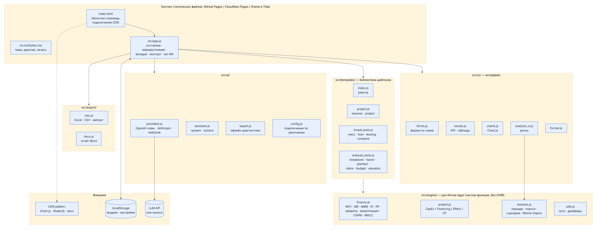
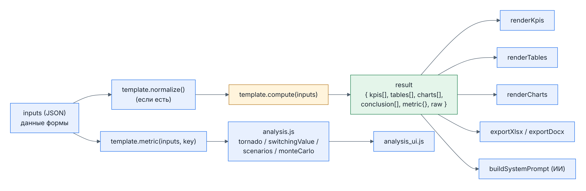
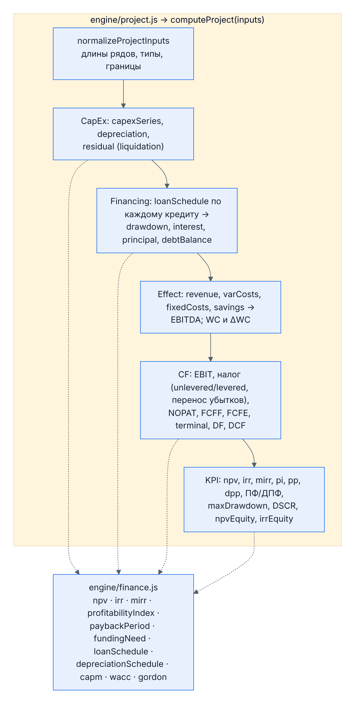
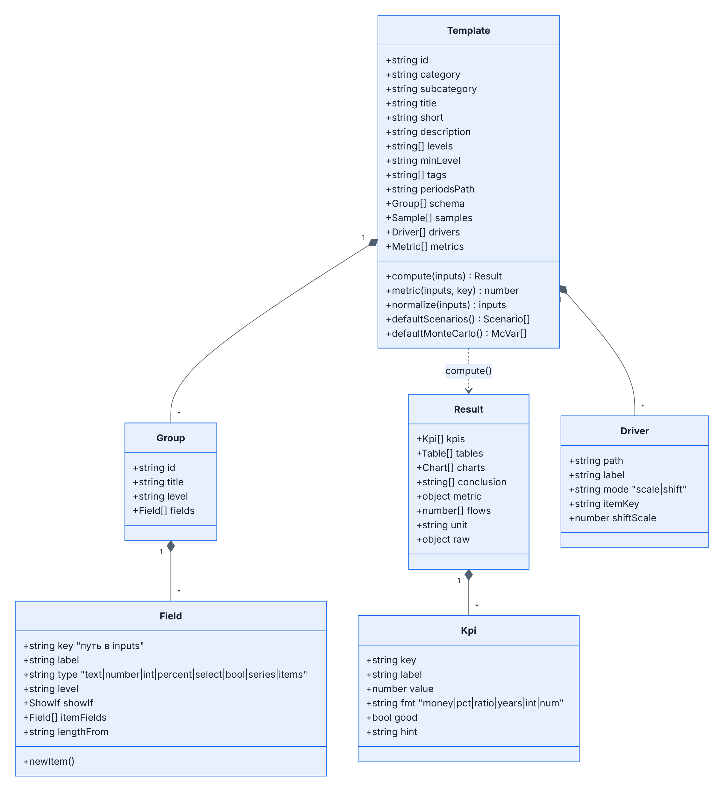
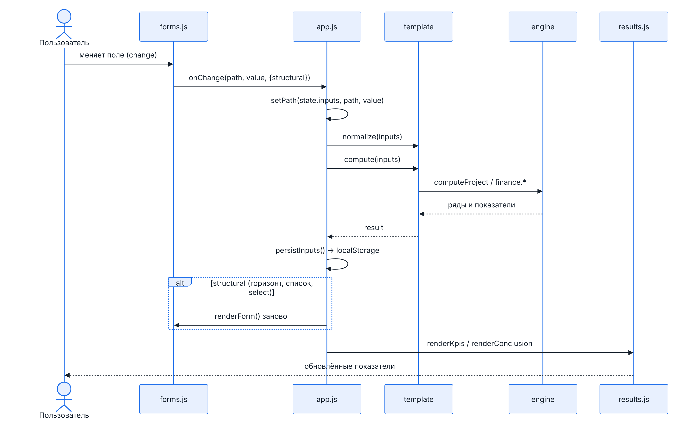
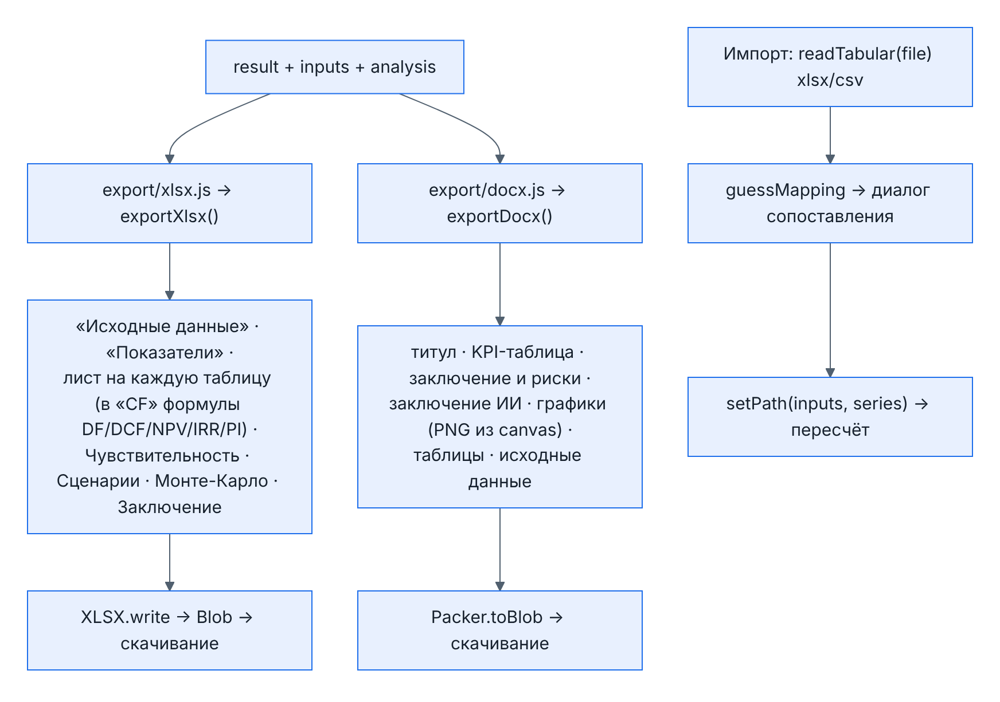
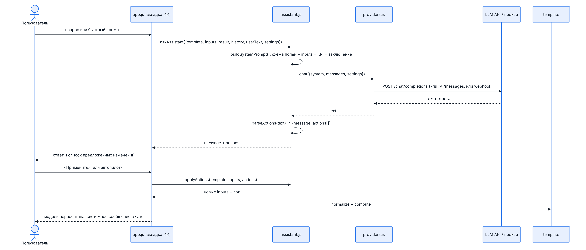
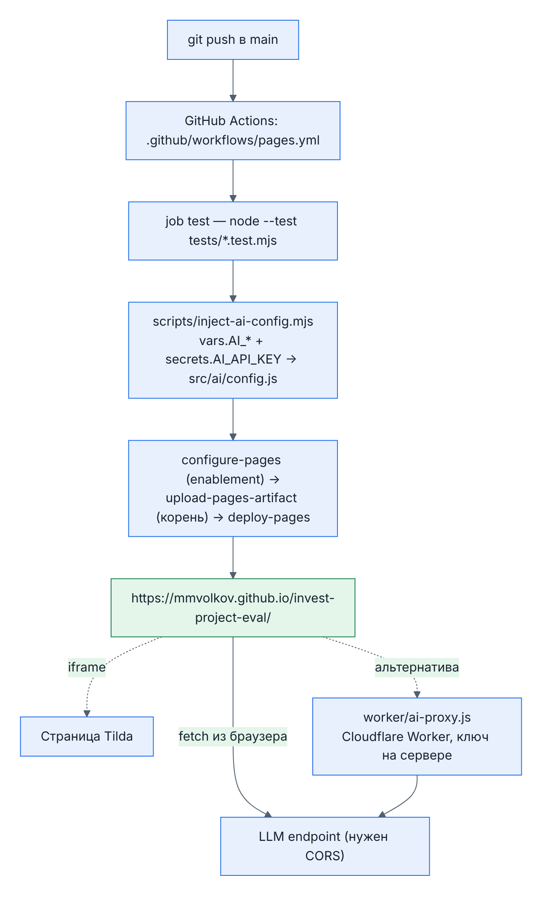

# Техническая документация: сервис «Оценка инвестпроектов»

Версия 1.0 · репозиторий `mmvolkov/invest-project-eval` · живой сайт https://mmvolkov.github.io/invest-project-eval/

Документ описывает архитектуру, каждый модуль, скрипт и компонент сервиса, форматы данных, протоколы и процедуры сборки, тестирования и развёртывания. Исходники схем лежат в `docs/diagrams/*.mmd` (mermaid), PNG-версии в `docs/img/`, рендер — `scripts/render-diagrams.mjs`.

---

## 1. Обзор и принципы

| Характеристика | Значение |
|---|---|
| Тип приложения | Одностраничное статическое веб-приложение (SPA), без сервера и сборки |
| Язык | JavaScript (ES2022, нативные ES-модули), HTML, CSS |
| Зависимости времени выполнения | Chart.js 4.4 (графики), SheetJS xlsx 0.18 (Excel/CSV), docx 9.7 (Word) — подключаются с CDN jsdelivr |
| Зависимости разработки | Node.js ≥ 20 (`node --test`), Playwright (e2e и рендер схем; в репозиторий не входит) |
| Хранение данных | `localStorage` браузера: введённые модели по шаблонам, настройки ИИ, уровень, тема |
| Внешние вызовы | Только LLM-провайдер по запросу пользователя (OpenAI-совместимый API, Anthropic, вебхук) |
| Хостинг | GitHub Pages (workflow в репозитории), Cloudflare Pages, любой статический хостинг; встраивание через iframe |
| Размер | ≈ 6 000 строк кода, 12 шаблонов, 28 юнит-тестов, e2e-сценарий |

**Принципы проектирования**

1. **Расчётное ядро отделено от DOM.** `src/engine/*` — чистые функции, работают и в браузере, и в Node (на этом построены тесты).
2. **Шаблон = данные + функция.** Любой инструмент описывается декларативной схемой полей и функцией `compute(inputs) → result`; формы, результаты, анализ рисков, экспорт и контекст ИИ подключаются к нему автоматически.
3. **Один канонический формат результата.** `{ kpis, tables, charts, conclusion, metric }` — его понимают рендереры, экспорт и ИИ.
4. **Анализ рисков универсален.** Чувствительность, сценарии и Монте-Карло работают через «драйверы» (путь к полю + способ изменения) и `template.metric()`, поэтому доступны любому шаблону.
5. **Без сборщика.** Код запускается как есть; это упрощает деплой на статический хостинг и встраивание.

---

## 2. Архитектура



*Рисунок 1. Слои приложения и их связи (источник: `docs/diagrams/t1-architecture.mmd`)*

Слои сверху вниз:

| Слой | Файлы | Ответственность |
|---|---|---|
| Оболочка | `index.html`, `src/ui/styles.css` | Разметка каркаса (шапка, каталог, рабочая область, модальные окна), подключение CDN-библиотек, темы, адаптив, печать |
| Приложение | `src/app.js` | Состояние, хэш-маршрутизация, каталог, уровни, вкладки, экспорт, импорт, чат ИИ, настройки |
| Интерфейс | `src/ui/*.js` | Рендер формы по схеме, KPI/таблицы/графики, вкладки анализа, форматирование |
| Шаблоны | `src/templates/*.js` | Библиотека из 12 инструментов: схема, примеры, расчёт, выводы, драйверы |
| Ядро | `src/engine/*.js` | Финансовая математика, модель проекта, методы анализа рисков, утилиты |
| Экспорт | `src/export/*.js` | Excel с формулами, CSV, Word с графиками, импорт xlsx/csv |
| ИИ | `src/ai/*.js` | Провайдеры LLM, системный промпт, протокол действий, офлайн-эксперт, конфиг по умолчанию |
| Инфраструктура | `.github/workflows/pages.yml`, `scripts/*.mjs`, `worker/*`, `tests/*` | CI/CD, подстановка конфига, рендер схем, сборка документов, прокси, тесты |

### 2.1. Поток данных



*Рисунок 2. От входных данных к результату и анализу*

Единственный источник истины — объект `state.inputs` (JSON). Любое изменение в форме записывается в него по пути (`setPath`), затем шаблон нормализует данные и пересчитывает результат. Результат никогда не хранится — он всегда производная от `inputs`, поэтому сохранение модели сводится к сохранению `inputs`.

---

## 3. Структура репозитория

```
index.html                      оболочка приложения
src/
  app.js                        главный модуль
  engine/
    finance.js                  финансовые функции
    project.js                  модель проекта CapEx/Financing/Effect/CF
    analysis.js                 чувствительность, сценарии, Монте-Карло
    utils.js                    пути, клонирование, ряды, драйверы
  templates/
    index.js                    реестр, категории, уровни
    project.js                  express, project
    invest_tools.js             wacc, loan, leasing, compare
    analysis_tools.js           breakeven, factor, planfact, ratios, budget, valuation
  ui/
    styles.css                  стили
    forms.js                    рендер формы по схеме
    results.js                  KPI, заключение, таблицы, графики
    charts.js                   обёртка Chart.js
    analysis_ui.js              вкладки анализа
    format.js                   форматирование, markdown, скачивание
  export/
    xlsx.js                     Excel, CSV, импорт
    docx.js                     отчёт Word
  ai/
    providers.js                вызов LLM
    assistant.js                промпт, разбор и применение действий
    expert.js                   офлайн-диагностика
    config.js                   подключение по умолчанию
scripts/
  inject-ai-config.mjs          подстановка конфига ИИ при деплое
  render-diagrams.mjs           mermaid → PNG
  build-business-docx.mjs       сборка бизнес-описания (docx)
worker/
  ai-proxy.js, wrangler.toml    Cloudflare Worker-прокси для ключей ИИ
tests/
  finance.test.mjs              ядро
  templates.test.mjs            все шаблоны и примеры
  assistant.test.mjs            протокол действий ИИ
  e2e.mjs                       сквозной тест в Chromium
docs/
  METHODOLOGY.md                методика расчётов
  TECHNICAL.md                  этот документ
  diagrams/*.mmd, img/*.png     схемы
  n8n-ai-assistant-workflow.json пример n8n
.github/workflows/pages.yml     CI: тесты + деплой на GitHub Pages
package.json                    скрипты npm (test, e2e, serve)
```

---

## 4. Расчётное ядро `src/engine/`

### 4.1. `finance.js` — финансовые функции

Все функции чистые. Потоки — массивы по периодам, индекс 0 соответствует моменту t = 0 (не дисконтируется). Ставки — доли (0.15 = 15 %).

| Функция | Назначение | Особенности |
|---|---|---|
| `sum(arr)` | Сумма с приведением к числу | — |
| `discountFactors(rate, n, {midYear})` | Коэффициенты 1/(1+r)^t | Опция дисконтирования на середину периода |
| `npv(rate, flows, {midYear})` | Чистая приведённая стоимость | flows[0] не дисконтируется |
| `signChanges(flows)` | Число смен знака | Диагностика множественных корней IRR |
| `irr(flows, opts)` | Внутренняя норма доходности | Поиск интервала на сетке + бисекция; `null`, если нет смены знака или корень не найден |
| `mirr(flows, financeRate, reinvestRate)` | Модифицированная IRR | FV притоков по ставке реинвестирования / PV оттоков |
| `profitabilityIndex(rate, flows)` | PI | PV положительных / PV отрицательных дисконтированных потоков |
| `cumulative(flows)` | Накопленный ряд | — |
| `paybackPeriod(flows, rate)` | PP (rate = 0) или DPP | Линейная интерполяция внутри периода; `null`, если не окупается |
| `fundingNeed(flows, rate)` | Потребность в финансировании ПФ/ДПФ | Сумма отрицательных (дисконтированных) потоков |
| `maxDrawdown(flows)` | Максимальный накопленный минус | — |
| `annuityPayment(principal, rate, n)` | Аннуитетный платёж | Обработка нулевой ставки |
| `loanSchedule({amount, rate, term, type, start, grace}, horizon)` | График кредита по периодам 0..horizon | Типы `annuity`, `equal`, `bullet`; отсрочка тела; остаток закрывается в последний период |
| `depreciationSchedule({amount, period, life, method}, horizon)` | Амортизация и остаточная стоимость | Линейная или уменьшаемого остатка (k = 2) |
| `capm({rf, beta, mrp, country, size, specific})` | Стоимость собственного капитала | — |
| `wacc({equity, debt, costEquity, costDebt, taxRate})` | Средневзвешенная стоимость капитала | Налоговый щит по долгу |
| `gordonTerminalValue(lastCf, g, r)` | Терминальная стоимость | `null`, если r ≤ g |
| `fisherReal(nominal, inflation)` | Реальная ставка | — |
| `effectiveAnnual(periodic, perYear)` | Эффективная годовая ставка | — |
| `growthSeries(base, g, n, {startAt})` | Ряд с постоянным ростом | Используется в экспресс-модели и бюджете |
| `quantile`, `mean`, `stdev`, `div` | Статистика и безопасное деление | Для Монте-Карло |

### 4.2. `project.js` — универсальная модель проекта



*Рисунок 3. Этапы расчёта `computeProject`*

**`DEFAULT_PROJECT_INPUTS`** — эталонная структура входных данных:

```js
{
  general:   { name, unit, periodLabel, startYear, horizon, discountRate, taxRate,
               lossCarryforward, midYear, reinvestRate },
  capex:     { items: [{ name, amount, period, life, method }], liquidation: { mode, value } },
  financing: { loans: [{ name, amount, rate, term, type, start, grace }] },
  effect:    { revenue[], variableCostPct, fixedCosts[], savings[], otherCapex[],
               wcPctRevenue, releaseWC, terminal: { method, growth, multiple } }
}
```

Проценты хранятся как числа в процентах (15 = 15 %), в ядре переводятся через `pct()`. Ряды имеют длину `horizon + 1`.

**`normalizeProjectInputs(raw)`** — приводит произвольный объект к эталону: дополняет значениями по умолчанию, ограничивает горизонт 1..60, выравнивает длины рядов (`fitSeries`), нормализует элементы списков.

**`computeProject(raw)`** — последовательность:

1. *CapEx*: суммирует вложения по периодам, строит амортизацию каждого объекта (`depreciationSchedule`), считает остаточную стоимость; ликвидационная стоимость по режиму `none | residual | value`.
2. *Financing*: для каждого кредита `loanSchedule`; агрегаты `drawdown`, `interest`, `principal`, `debtBalance`.
3. *Effect*: переменные затраты как доля выручки, EBITDA = выручка − переменные − постоянные + экономия; оборотный капитал как доля выручки, прирост ΔWC и высвобождение в конце.
4. *CF*: EBIT, налог без учёта процентов (для FCFF) и с учётом (для FCFE), оба с опциональным переносом убытков; NOPAT; терминальная стоимость (Гордон или мультипликатор EBITDA); FCFF, FCFE, коэффициенты дисконтирования, DCF, накопленные ряды.
5. *KPI*: `npv`, `irr`, `mirr`, `pi`, `pp`, `dpp`, `fundingNeed`, `fundingNeedDisc`, `maxDrawdown`, `totalInvestment`, `totalDebt`, `npvEquity`, `irrEquity`, `liquidation`, `terminal`, `pvTerminal`, `terminalShare`, `arr`, `minDscr`, `dscr[]`, `signChanges`, `avgEbitdaMargin`; профиль NPV по ставкам 0…60 % для графика.

Возвращает `{ inputs, N, n, periods, labels, series{…}, capexRows, loanRows, kpi, npvProfile }`.

**`periodLabel(general, t)`** — подпись периода (год как число, иначе «Старт», «квартал 1»…).

**`expressToProject(e)`** — превращает 7–10 полей экспресс-модели в канонические входы: инвестиция одним объектом со сроком службы = горизонту, выручка и постоянные затраты как ряды с ростом.

### 4.3. `analysis.js` — анализ рисков

Все функции принимают `metricFn(inputs) → number` и список драйверов `{ path, label, mode: 'scale' | 'shift', itemKey?, shiftScale? }`.

| Функция | Что делает |
|---|---|
| `sensitivityTable(metricFn, inputs, drivers, steps)` | Таблица «драйвер × шаг» (−30…+30 %), эластичность по шагу +10 % |
| `tornado(metricFn, inputs, drivers, delta)` | Значения при ±delta, сортировка по размаху |
| `switchingValue(metricFn, inputs, driver, target)` | Изменение драйвера, при котором метрика = target (бисекция на сетке −95…+300 %) |
| `scenarios(computeFn, inputs, list, metricKey)` | Применяет наборы изменений (`set | scale | shift`) с вероятностями, считает взвешенное ожидание |
| `rng(seed)` | Детерминированный ГСЧ mulberry32 |
| `monteCarlo(metricFn, inputs, vars, {iterations, seed, bins})` | Треугольное / равномерное / нормальное распределения, статистики P5…P95, вероятность < 0, гистограмма |

Для драйверов режима `shift` значение интерпретируется как абсолютный сдвиг (п.п.); `shiftScale` задаёт, сколько единиц соответствует «10 %» в интерфейсе (по умолчанию 1 п.п.).

### 4.4. `utils.js`

`deepClone`, `getPath`/`setPath` (пути через точку, числовые сегменты создают массивы), `fitSeries(arr, n)`, `pct`, `round`, `applyDriver(inputs, driver, x)` (масштабирует число, ряд или поле элементов списка на копии данных), `uid`.

---

## 5. Библиотека шаблонов `src/templates/`

### 5.1. Интерфейс шаблона



*Рисунок 4. Структура объекта шаблона*

| Свойство | Тип | Описание |
|---|---|---|
| `id`, `category`, `subcategory`, `title`, `short`, `description`, `tags` | string | Идентификация и тексты каталога; `category` ∈ `invest | analysis | budget | reports` |
| `levels`, `minLevel` | string[] | Допустимые уровни `express | basic | pro`; при открытии шаблона уровень автоматически поднимается до допустимого |
| `periodsPath` | string | Путь к числу периодов; ряды получают длину `periods + 1` (t0…tN) |
| `schema` | Group[] | Группы полей: `{ id, title, level, fields[] }` |
| `samples` | Sample[] | Примеры `{ id, name, inputs }`; первый используется по умолчанию |
| `drivers`, `metrics` | Driver[], Metric[] | Для анализа рисков; `metrics[0]` — метрика по умолчанию |
| `compute(inputs)` | function | Возвращает `Result` |
| `metric(inputs, key)` | function | Число для анализа; обычно обёртка над `compute` |
| `normalize(inputs)` | function? | Приведение входов (только у `project`) |
| `defaultScenarios()`, `defaultMonteCarlo()` | function? | Типовые сценарии и распределения |

**Типы полей** (`Field.type`): `text`, `number`, `int`, `percent`, `select` (с `options`), `bool`, `series` (ряд по периодам; длина из `lengthFrom` + `plusOne` либо `periodsPath`), `items` (список объектов с `itemFields`, `newItem()`). Дополнительно: `level` (видимость по уровню), `showIf: { path, equals }`, `help`, `min/max/step`, `optional`.

**Формат `Result`:**

```js
{
  kpis: [{ key, label, value, fmt: 'money|pct|ratio|years|int|num|bool', good: true|false|null, hint }],
  tables: [{ id, title, unit?, columns: [{ label, fmt }], rows: [{ cells: [...], style?: 'total|subtotal|header|warn', fmt? }] }],
  charts: [{ id, title, type: 'bar|line|mixed|doughnut|horizontalBar|waterfall|histogram|tornado', labels, datasets: [{ label, data, type? }], stacked?, zeroLine? }],
  conclusion: ['строка', ...],
  metric: { npv: 123, ... },          // значения для template.metric
  flows?: number[], labels?: string[], unit?: string, raw?: object
}
```

### 5.2. Реестр `index.js`

`CATEGORIES` (4 раздела с иконками), `LEVELS` (`express` 0, `basic` 1, `pro` 2), `TEMPLATES` (порядок показа), `getTemplate(id)`, `levelRank(id)`.

### 5.3. Шаблоны

| id | Файл | Уровни | Ядро расчёта | Драйверы (чувствительность) |
|---|---|---|---|---|
| `express` | project.js | express | `expressToProject` → `computeProject` | выручка, доля переменных, постоянные, инвестиции, ставка |
| `project` | project.js | basic, pro | `computeProject`; 4 примера, включая ферму из методики и проект с кредитом и терминальной стоимостью | выручка, доля переменных, постоянные, CapEx (itemKey amount), ставка, налог, оборотный капитал |
| `compare` | invest_tools.js | basic, pro | NPV/IRR/MIRR/PI/PP/DPP для каждого проекта, ранги, приростной поток лидеров, жадный отбор портфеля по PI под бюджет | ставка |
| `wacc` | invest_tools.js | basic, pro | `capm` + `wacc` + `fisherReal` | бета, безрисковая, премия, стоимость долга, долг |
| `loan` | invest_tools.js | basic, pro | `loanSchedule` с комиссией и страховкой → эффективная ставка через `irr` + `effectiveAnnual` | ставка, страховка, комиссия |
| `leasing` | invest_tools.js | basic, pro | PV затрат после налога: кредит (щит по % и амортизации) vs лизинг (щит по платежам) | удорожание, ставка кредита, ставка дисконтирования |
| `breakeven` | analysis_tools.js | express, basic, pro | CVP: маржинальный доход, BEP, запас прочности, операционный рычаг, целевой объём | цена, переменные на ед., постоянные, объём |
| `factor` | analysis_tools.js | basic, pro | Цепные подстановки: объём → цена → удельные переменные → постоянные | — |
| `planfact` | analysis_tools.js | express, basic, pro | Отклонения, существенность, ABC по вкладу | — |
| `budget` | analysis_tools.js | basic, pro | 12 месяцев: план продаж с ростом, переменные как % выручки, лаги оплаты → БДР, БДДС, баланс с проверкой | план продаж, доля переменных, постоянные |
| `valuation` | analysis_tools.js | basic, pro | PV FCF + TV (Гордон/мультипликатор) → EV → капитал; матрица WACC × g | FCF, WACC, рост, чистый долг |
| `ratios` | analysis_tools.js | basic, pro | 17 коэффициентов с нормативами, финансовый цикл, Дюпон | — |

В `project.js` также экспортируются `projectConclusion(res)` (алгоритмическое заключение), `formatMoney`, `fmtYears`, константы `PROJECT_DRIVERS`, `PROJECT_METRICS`.

### 5.4. Как добавить шаблон

1. Создать объект по образцу `breakevenTemplate` в одном из файлов `src/templates/` (или новом файле).
2. Описать `schema`, минимум один `samples`, `compute` и `metric`; при наличии драйверов — `drivers`/`metrics`.
3. Добавить в массив `TEMPLATES` в `index.js`.
4. Запустить `npm test`: тест `templates.test.mjs` автоматически проверит все примеры, торнадо, сценарии и Монте-Карло нового шаблона.

---

## 6. Приложение `src/app.js`

Главный модуль: ~750 строк, без фреймворков. Основные части:

| Блок | Функции | Описание |
|---|---|---|
| Состояние | `state`, `LS` | `state = { level, templateId, template, inputs, sampleId, tab, result, analysis, ai }`. `LS` — безопасная обёртка над localStorage (ключи `ipe:level`, `ipe:theme`, `ipe:ai`, `ipe:inputs:<templateId>`) |
| Маршрутизация | `parseHash`, `navigate`, `route` | Хэш-маршруты `#/` и `#/t/<id>?sample=&level=&tab=`; `hashchange` → `route()` |
| Каталог и уровни | `renderCatalog`, `renderLevels`, `setLevel` | Поиск по названию/тегам, бейджи уровней, блокировка недопустимых уровней |
| Главная | `renderHome` | Hero, три уровня, карточки шаблонов по категориям |
| Рабочая область | `openTemplate`, `renderWorkspace`, `renderTab`, `TABS` | Загрузка примера или сохранённых данных, шапка с примерами/импортом/JSON/сбросом, семь вкладок |
| Ввод | `renderInputsTab`, `renderLive`, `compute`, `persistInputs` | `onChange(path, value, {structural})` → `setPath` → `normalize` → `compute` → живые KPI; при структурных изменениях форма перерисовывается |
| Результаты | `renderResultsTab` | KPI, заключение, графики, таблицы с CSV |
| Экспорт | `renderExportTab`, `analysisSummary` | Кнопки Excel/Word/печать/CSV; `analysisSummary` собирает торнадо, пороги, сценарии и Монте-Карло в таблицы и строки для отчёта |
| Импорт | `pickFile`, `openImportDialog` | Чтение xlsx/csv → автосопоставление строк с полями-рядами → применение с опциональным сдвигом на t0 |
| ИИ | `renderAiTab` | Чат, быстрые промпты, офлайн-диагностика, настройки провайдера, применение действий, «автопилот», кнопка «По умолчанию» |
| Скрытый чат | `openFreeChat` | Модальное окно свободного диалога с моделью; открывается двойным кликом по кнопке «Проверить» (см. 9.5) |
| Настройки | `openSettings`, `applyTheme` | Тема (auto/light/dark), очистка сохранённых моделей |
| Инициализация | `init` | Навешивает обработчики, запускает маршрутизацию, публикует `window.__ipe = { state, TEMPLATES }` для тестов |



*Рисунок 5. Что происходит при изменении поля*

---

## 7. Интерфейс `src/ui/`

### 7.1. `forms.js`

- `renderForm(container, template, inputs, levelId, onChange)` — строит группы и поля по схеме, скрывая группы/поля выше текущего уровня и не прошедшие `showIf`.
- `renderField` — по типу поля создаёт `input`/`select`/чекбокс/таблицу ряда/таблицу списка. Числовые поля валидируют `min/max`, `int` округляет; изменение поля-источника длины (`periodsPath`, `lengthFrom`) помечается как структурное.
- Ряды (`series`): горизонтальная таблица с подписями периодов, навигация стрелками, вставка нескольких чисел из буфера (`parseNumbers` понимает «1 234,5» и «1,234.5»), инструменты «база + рост», «вставить из буфера», «очистить».
- Списки (`items`): таблица с полями элементов (включая вложенные ряды), добавление/удаление.
- `seriesLength`, `seriesLabels`, `flattenFields` — вспомогательные, используются также экспортом и ИИ.

### 7.2. `results.js`

`renderKpis` (карточки с цветом по `good`), `renderConclusion`, `renderCharts` (создаёт canvas и вызывает `renderChart`), `tableHtml` (sticky-заголовки и первая колонка, подсветка отрицательных и стилей строк), `renderTables` (с кнопкой CSV).

### 7.3. `charts.js`

Обёртка над глобальным `Chart`: палитра, тёмная тема через CSS-переменные, типы `bar`, `line`, `mixed`, `doughnut`, `horizontalBar`, `waterfall` (плавающие столбцы), `tornado` (горизонтальные бары от базы), `histogram`. `allChartImages(root)` отдаёт PNG (base64) для отчёта Word. Экземпляры хранятся в `Map` по canvas и уничтожаются при перерисовке.

### 7.4. `analysis_ui.js`

- `renderSensitivity` — выбор метрики и δ, торнадо-диаграмма, таблица порогов, таблица чувствительности с эластичностью, текстовые выводы.
- `renderScenarios` — редактор сценариев (имя, вероятность, список изменений по драйверам), таблица результатов по всем метрикам, ожидаемое значение, график.
- `renderMonteCarlo` — редактор переменных (драйвер, распределение, параметры в % или п.п.), число итераций, запуск в `setTimeout` (чтобы отрисовать индикатор), статистики, гистограмма с подсветкой отрицательной зоны, выводы. Результат сохраняется в `state.analysis.mcResult` и попадает в экспорт.

Состояние вкладок анализа хранится в `state.analysis` (`metric`, `delta`, `scenarios`, `mcVars`, `mcIterations`, `mcMetric`, `mcResult`) и сохраняется в JSON модели.

### 7.5. `format.js`

`fmt(value, kind)` — форматирование чисел ru-RU по виду (`money`, `pct`, `ratio`, `factor`, `years`, `int`, `num`, `bool`), нули без знака минус; `escapeHtml`; `mdToHtml` (заголовки, списки, жирный, код, таблицы — для ответов ИИ); `downloadBlob`; `safeName`.

### 7.6. `styles.css`

CSS-переменные для светлой и тёмной темы (`prefers-color-scheme` и `data-theme`), сетка «каталог + рабочая область», адаптив до 390 px (выезжающий каталог, перенос панели инструментов), печатные стили (скрываются шапка, каталог, вкладки).

---

## 8. Экспорт и импорт `src/export/`



*Рисунок 6. Формирование Excel, Word и импорт*

### 8.1. `xlsx.js`

- `exportXlsx({ template, inputs, levelId, result, extra })` — книга: «Исходные данные» (все поля схемы, ряды и списки), «Показатели», лист на каждую таблицу результата (имя из заголовка, ≤ 31 символа), «Чувствительность», «Сценарии», «Монте-Карло», «Заключение» (включая текст ИИ). Числовые форматы по `fmt` колонок.
- Для таблицы `cf` добавляются живые формулы: строка номеров периодов, ячейка ставки, коэффициенты дисконтирования `=1/(1+$B$n)^t`, DCF `=FCFF*DF`, `NPV =SUM(...)`, `IRR =IFERROR(IRR(...))`, `PI` через `SUMIF`.
- `exportCsv(table)` — разделитель `;`, десятичная запятая, BOM UTF-8 (формат русского Excel).
- `readTabular(file)` — читает xlsx/xls/csv, возвращает строки вида `{ sheet, row, label, values[] }`, где первая ячейка — подпись, далее ≥ 2 числа.
- `guessMapping(template, inputs, rows)` — для каждого поля-ряда подбирает строку по совпадению слов подписи.

### 8.2. `docx.js`

`exportDocx({ template, inputs, levelId, result, charts, aiConclusion, analysisText })` — документ docx.js: титул, таблица KPI с оценкой, заключение (алгоритмическое, анализ рисков, ИИ), графики (`ImageRun` из PNG canvas), расчётные таблицы (альбомная ориентация, если > 8 колонок), исходные данные. Скачивание через `Packer.toBlob`.

---

## 9. ИИ-ассистент `src/ai/`



*Рисунок 7. Запрос к ассистенту и применение действий*

### 9.1. `providers.js`

- `PROVIDERS` — три варианта: `openai` (любой OpenAI-совместимый `/chat/completions`), `anthropic` (`/v1/messages` с заголовком `anthropic-dangerous-direct-browser-access`), `webhook` (POST JSON `{ system, messages, context, model }`, ответ `{ reply }` либо любой разумный формат — `extractText`).
- `DEFAULT_AI_SETTINGS` — temperature 0.2, max_tokens 2000, `autoApply: false`, дополнительные заголовки.
- `chat({ system, messages, context, settings, signal })` — единая точка вызова; ошибки HTTP превращаются в исключения с текстом ответа.

Требование к провайдеру при прямом вызове из браузера: корректный CORS (ответ на `OPTIONS` без авторизации с `Access-Control-Allow-Origin`). Иначе — прокси.

### 9.2. `assistant.js`

- `buildSystemPrompt(template, inputs, result, levelId)` — роль финансового аналитика, описание шаблона, перечень полей с путями и типами, текущие `inputs` (JSON), KPI, алгоритмическое заключение, правила протокола действий.
- `QUICK_PROMPTS` — пять быстрых запросов (проверка допущений, заключение, подбор ставки, пессимистичный вариант, меры по росту NPV).
- `parseActions(text)` — извлекает блок ` ```json {"actions":[…]} ``` ` (или первый JSON с ключом `actions`), возвращает `{ message, actions, parseError? }`.
- `applyActions(template, inputs, actions)` — операции `set`, `scale`, `shift`, `add_item`, `remove_item`; пути проверяются по схеме шаблона (поддерживаются `items[0].field` и `items.0.field`); возвращает новую копию `inputs` и лог. Неизвестные поля отклоняются.
- `askAssistant({...})` — собирает историю (последние 12 сообщений), вызывает `chat`, разбирает ответ.

**Протокол действий** (ответ модели):

```json
{"actions":[
  {"op":"set","path":"general.discountRate","value":18,"why":"WACC по CAPM"},
  {"op":"scale","path":"effect.revenue","value":-0.15},
  {"op":"shift","path":"general.taxRate","value":5},
  {"op":"add_item","path":"financing.loans","value":{"name":"Кредит","amount":500,"rate":18,"term":5,"type":"annuity","start":0,"grace":0}},
  {"op":"remove_item","path":"capex.items","index":1}
]}
```

### 9.3. `expert.js`

`expertReview(template, inputs, result)` — алгоритмическая диагностика без LLM: проверка ставки, скачков выручки, маржи, срока службы vs горизонта, оборотного капитала, множественных корней IRR, DSCR, доли терминальной стоимости, запаса IRR; торнадо и порог по выручке; предупреждения, рекомендации, чек-лист. Возвращает markdown.

### 9.4. `config.js`

`DEFAULT_AI_CONFIG` — подключение по умолчанию для всех посетителей (сейчас учебный OpenAI-совместимый сервер с моделью `qwen3.8-27b-nvfp4`, ключ-заглушка). Перезаписывается при деплое скриптом `scripts/inject-ai-config.mjs` из переменных `AI_PROVIDER`, `AI_BASE_URL`, `AI_MODEL`, `AI_LABEL` и секрета `AI_API_KEY`. Пользовательские настройки из localStorage имеют приоритет; кнопка «↺ По умолчанию» возвращает конфиг.

---

### 9.5. Скрытый режим: свободный чат с моделью

Недокументированная в интерфейсе возможность: **двойной клик по кнопке «Проверить»** во вкладке «ИИ-ассистент» открывает модальное окно `💬 Чат с моделью`. Реализация — функция `openFreeChat()` в `src/app.js`.

| Аспект | Как устроено |
|---|---|
| Вызов | На кнопке `#aiTest` два обработчика. `click` запускает проверку подключения через `setTimeout` 280 мс; `dblclick` сбрасывает этот таймер (`clearTimeout`), сохраняет настройки (`saveSettings()`) и вызывает `openFreeChat()`. Так одиночный и двойной клик не конфликтуют |
| Окно | Строится общим помощником `modal(html)` (тот же, что у настроек и импорта): заголовок с именем модели, лог сообщений `#freeLog`, поле ввода `#freeText`, кнопки «Отправить», «Очистить историю», закрытие по `✕`, клику на подложку и `Esc` |
| Провайдер | Тот же `chat()` из `src/ai/providers.js` и те же `state.ai.settings`, что у ассистента: смена провайдера, ключа или модели в настройках действует и на скрытый чат |
| Контекст | Финансовая модель в запрос **не передаётся**. Системный промпт фиксированный: «Ты — полезный ассистент. Отвечай по-русски, кратко и по делу. Используй markdown». В историю уходят последние 20 сообщений |
| История | `state.ai.freeHistory` — отдельный массив, не пересекается с `state.ai.history` основного чата, в localStorage и в JSON модели не сохраняется, живёт до перезагрузки вкладки; при повторном открытии окна восстанавливается |
| Ввод | `Ctrl+Enter` / `Cmd+Enter` отправляет, во время запроса кнопка блокируется и показывает индикатор; ответ рендерится через `mdToHtml`, ошибки запроса показываются системным сообщением в логе |
| Назначение | Быстрая проверка качества и доступности подключённой модели «вне контекста», черновые вопросы по методике, сравнение моделей после смены настроек |

Проверка: сценарий `scratchpad/freechat.mjs` в сеансе разработки (двойной клик → ответ → Esc → повторное открытие с историей → одиночный клик по-прежнему выполняет проверку) пройден локально и на опубликованном сайте.

---

## 10. Инфраструктура и скрипты



*Рисунок 8. Конвейер публикации*

| Файл | Назначение |
|---|---|
| `.github/workflows/pages.yml` | На push в `main` и в PR: job `test` (`node --test tests/*.test.mjs`); на `main` дополнительно job `deploy`: подстановка конфига ИИ, `configure-pages` (с `enablement: true`), загрузка корня репозитория как артефакта, `deploy-pages`. Требует Settings → Pages → Source: GitHub Actions |
| `scripts/inject-ai-config.mjs` | Читает `AI_*` из окружения, валидирует провайдера, перезаписывает `src/ai/config.js`. Пустые переменные не меняют значения по умолчанию |
| `scripts/render-diagrams.mjs` | Рендерит `docs/diagrams/*.mmd` в `docs/img/*.png` через headless Chromium и mermaid 11 (масштаб 2×) |
| `scripts/build-business-docx.mjs` | Собирает `docs/Описание_сервиса_для_бизнеса.docx` библиотекой docx.js со схемами |
| `scripts/build-presentation.mjs` | Собирает `docs/Презентация_сервиса.pptx` библиотекой pptxgenjs (16 слайдов, тема, макеты TITLE/CONTENT/DARK, секции, QR-код на сайт). Использует схемы из `docs/img` и скриншоты живого сайта (каталог в `SHOTS`); модули берутся из `PPTX_MODULES` |
| `scripts/video/record.mjs` | Playwright записывает сцены живого сайта (1920×1080, webm) с имитацией курсора и метками времени (`VID=<папка> node record.mjs [сцена]`); сцены: home, express, levels, risk, ai, export. `HIDE_LINKS=1` прячет панель настроек ИИ (адрес сервера) и ссылки на GitHub для ролика без ссылок |
| `scripts/video/script.json` | Сценарий видео: порядок сцен (слайд `s-NN.png` из `docs/Презентация_сервиса.pptx` или запись `demo`) и текст диктора |
| `scripts/video/script_nolinks.json` | Тот же сценарий для ролика без ссылок на сайт: финальная сцена «доступ по запросу». Слайды для него собираются `NO_LINKS=1 OUT=<путь> node scripts/build-presentation.mjs` (без адреса в подвале, титуле и без QR-кода) |
| `scripts/video/assemble.py` | Озвучка (`edge-tts`, голос ru-RU-DmitryNeural) уже лежит в `tts/`; скрипт собирает сегменты ffmpeg (слайд + озвучка, запись + озвучка с вырезанным ожиданием ответа ИИ), склеивает, накладывает субтитры ASS → `final.mp4` = `docs/Демонстрация_сервиса.mp4` |
| `worker/ai-proxy.js`, `worker/wrangler.toml` | Cloudflare Worker: принимает `{ system, messages, model }`, добавляет серверный ключ, вызывает OpenAI-совместимый или Anthropic API, отдаёт `{ reply }` с CORS; опциональный `ACCESS_TOKEN` |
| `docs/n8n-ai-assistant-workflow.json` | n8n: Webhook → Code → OpenAI → Respond to Webhook с тем же контрактом |
| `package.json` | `npm test`, `npm run e2e`, `npm run serve` |
| `.nojekyll` | Отключает Jekyll на GitHub Pages (иначе файлы с подчёркиваниями могут не публиковаться) |

---

## 11. Тестирование

| Набор | Файл | Что проверяет |
|---|---|---|
| Ядро | `tests/finance.test.mjs` | Контрольные примеры из открытых источников: NPV −52 303; аннуитет 263 797 и 21 247/мес; IRR кредита = ставке; окупаемость фермы (PP 6-й год, DPP 9-й, ПФ 340, ДПФ 337); множественные корни IRR; PI, MIRR, CAPM, WACC, амортизация; согласованность модели (NPV = ΣDCF, FCFF = NOPAT + D − CapEx − ΔWC + TV); экспресс → проект; торнадо, пороги, сценарии, Монте-Карло |
| Шаблоны | `tests/templates.test.mjs` | Для каждого шаблона и каждого примера: структура результата, таблицы, выводы, драйверы, сценарии, Монте-Карло; проверка реальной ставки 12,9 % и сходимости баланса |
| ИИ | `tests/assistant.test.mjs` | Разбор блока actions, применение всех операций, индексы в обеих нотациях, отклонение неизвестных полей, неизменность исходных данных |
| Сквозной | `tests/e2e.mjs` | Headless Chromium: загрузка CDN, каталог, все шаблоны и вкладки, Монте-Карло, пересчёт при изменении, уровни, выгрузка xlsx/docx/csv, офлайн-диагностика, мобильная ширина, скриншоты. Запуск `node tests/e2e.mjs [baseUrl]` — без аргумента файлы отдаются из репозитория через перехват запросов, с аргументом тестируется опубликованный сайт |

Команды:

```bash
npm test                                   # юнит-тесты (CI)
node tests/e2e.mjs                         # локальный e2e
node tests/e2e.mjs https://mmvolkov.github.io/invest-project-eval   # e2e на проде
```

---

## 12. Развёртывание и эксплуатация

**GitHub Pages.** Settings → Pages → Source: GitHub Actions; затем любой push в `main`. Адрес `https://<логин>.github.io/invest-project-eval/`.

**Cloudflare Pages.** Подключить репозиторий, preset None, build command пустой, output `/`.

**Tilda / любой сайт.** Блок HTML с `<iframe src="…/#/t/express?sample=cafe">`. Ссылки на конкретный шаблон и пример: `#/t/<id>?sample=<sampleId>&level=<express|basic|pro>&tab=<inputs|results|…>`.

**Смена модели ИИ по умолчанию.** Variables `AI_PROVIDER`, `AI_BASE_URL`, `AI_MODEL`, `AI_LABEL`, Secret `AI_API_KEY` в Settings → Secrets and variables → Actions; затем push или Re-run workflow. Для боевого ключа — Worker (`wrangler secret put PROVIDER_KEY`, `wrangler deploy`) и `AI_PROVIDER=webhook`.

**Локальная разработка.** `npx serve .` (или любой статический сервер), ES-модули требуют http(s), не `file://`.

---

## 13. Ограничения и возможные доработки

- НДС, валютные курсы и отраслевые налоговые режимы не моделируются.
- Налог на прибыль: положительная база, перенос убытков без ограничения срока.
- Лизинг: аннуитет по ставке удорожания, аванс списывается сразу.
- Ключ ИИ при прямом подключении виден в браузере пользователя; для корпоративного использования — прокси.
- Возможные доработки: помесячные модели проектов с годовой агрегацией, сравнение версий модели, совместная работа через серверное хранилище, импорт из 1С/CRM через n8n, пакетная оценка портфеля проектов.
